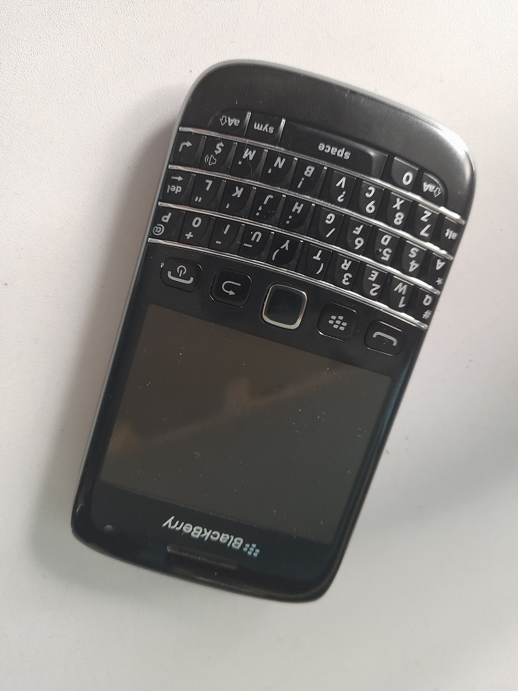

# JPH Messenger

[](LICENSE)
[](https://en.wikipedia.org/wiki/BlackBerry_OS)
[](legacy-gateway/pwa/)
[](https://www.gsmarena.com/blackberry_bold_9790-4332.php)
[](https://fastapi.tiangolo.com/)
[](https://github.com/The-Pocket/Agent-Zero)
[](legacy-gateway/compose.yaml)

[](https://commons.wikimedia.org/wiki/File:BlackBerry_Bold_9790.jpg)

*JPH Messenger brings a legacy BlackBerry Bold 9790 (RE071UW) back to life as a modern messaging device with AI agent control.*

---

## What is JPH Messenger?

JPH Messenger is a self-hosted, privacy-focused messaging platform that connects a **BlackBerry Bold 9790** running BlackBerry OS 7.1 to modern infrastructure:

- 📱 **Cross-generation messaging** — Send/receive messages between your Bold and modern devices
- 🤖 **Agent Zero integration** — Chat with AI agents directly from your BlackBerry
- 🔐 **Secure** — Device-specific credentials, no cloud dependency
- 📶 **Wi-Fi first** — Works over Wi-Fi (primary) or 2G GPRS/EDGE (when available)

---

## Architecture

```
┌─────────────┐     ┌─────────────┐     ┌─────────────┐
│ BlackBerry  │────▶│ JPH Legacy  │────▶│  Synapse    │
│ Bold 9790   │     │   Gateway  │     │  (Matrix)   │
│ Wi-Fi/2G    │     │  Docker    │     │  Docker     │
└─────────────┘     └──────┬──────┘     └─────────────┘
                            │
                     ┌──────▼──────┐
                     │   Agent      │
                     │  Adapter     │
                     │  (→ A0)      │
                     └─────────────┘
```

---

## Quick Start

### Prerequisites

- **Server**: Docker + Docker Compose on Debian Linux
- **BlackBerry**: Bold 9790 with OS 7.1
- **Network**: Server and Bold on the same Wi-Fi network

### Step 1: Clone & Configure

```bash
git clone https://github.com/YOUR_USERNAME/jph-messenger.git
cd jph-messenger/legacy-gateway

# Copy environment template
cp .env.example .env
# Edit .env with your settings
```

### Step 2: Start the Gateway

```bash
# Build and run
docker compose up -d --build

# Verify
curl http://localhost:8080/health
```

### Step 3: Install on BlackBerry

1. Open BlackBerry Browser
2. Navigate to: `http://YOUR_SERVER_IP:8080/ota/JPHMessenger.jad`
3. Download and install

### Step 4: Configure the App

On your Bold:

1. Launch **JPH Messenger**
2. Set server URL: `http://YOUR_SERVER_IP:8080`
3. Menu → **Register**
4. Menu → **Ping** — should show success

---

## Connecting to Agent Zero

JPH Messenger can route messages to **Agent Zero** for AI-powered conversations.

### Option 1: Same Server (Recommended)

If Agent Zero runs on the same Docker network:

```bash
# Set A0_API_URL to the internal Docker network address
A0_API_URL=http://host.docker.internal:80 A0_API_KEY=your_api_key docker compose up -d
```

### Option 2: Remote Agent Zero

If Agent Zero runs on a different server:

```bash
# Set the remote URL
A0_API_URL=http://192.168.1.50:80 A0_API_KEY=your_api_key docker compose up -d
```

### Getting Your Agent Zero API Key

1. Open Agent Zero WebUI
2. Go to **Settings** → **API**
3. Copy the **API Key** (or set a new one)
4. Use this key as `A0_API_KEY`

### Testing Agent Zero

On your BlackBerry:

1. Set **To:** field to `agent-zero`
2. Type a message: `Hello, who are you?`
3. Menu → **Send message**
4. Menu → **Sync messages**

You should receive Agent Zero's reply!

---

## BlackBerry App Features

| Feature | Description |
|---------|-------------|
| **Register** | Authenticate device with server |
| **Ping** | Test connectivity |
| **Send message** | Send to any recipient |
| **Sync messages** | Fetch new messages |
| **Settings** | Edit server URL, default recipient, connection type (Wi-Fi / 2G-3G) |
| **Unregister** | Remove device from server + auto-reboot |
| **Reset credentials** | Clear local credentials |

### Settings Screen

```
┌─────────────────────────────┐
│ Server: [http://192.168...] │
│ Default To: [agent-zero]    │
│ Connection:                 │
│ (•) Wi-Fi (recommended)     │
│ ( ) Cellular (2G/3G)        │
│                             │
│        [Save] [Cancel]      │
│        Version: 0.4.0       │
└─────────────────────────────┘
```

- **Wi-Fi** uses `;interface=wifi` (default, no APN required)
- **Cellular** uses `;deviceside=true` (direct TCP over carrier 2G/3G, APN must be configured on the device)

---

## Menu Commands

| Command | Action |
|---------|--------|
| Settings | Edit server URL, default recipient, connection type |
| Send message | Send message to recipient |
| Sync messages | Fetch new messages from server |
| Register | Register device with gateway |
| Ping | Test server connectivity |
| Unregister | Remove from server (offers reboot) |
| Reset credentials | Clear local data |

---

## Troubleshooting

### "APN is not specified" Error

- Ensure Wi-Fi is enabled on the Bold
- The app uses Wi-Fi by default (`;interface=wifi`)

### Registration Fails

- Check the gateway is running: `curl http://localhost:8080/health`
- Verify server IP in the app matches your network

### Agent Zero Not Responding

1. Verify A0 connection:
   ```bash
   curl -X POST http://YOUR_A0_IP/api/message \
     -H "Content-Type: application/json" \
     -H "X-API-Key: YOUR_API_KEY" \
     -d '{"message":"ping"}'
   ```
2. Check gateway logs:
   ```bash
   docker compose logs jph-gateway
   ```

### Need to Reinstall

1. On Bold: Menu → **Unregister**
2. Device will reboot
3. Reinstall via browser

---

## Development

### Building the BlackBerry App

```bash
cd blackberry-app
./build.sh
```

Output: `ota/JPHMessenger.cod`, `ota/JPHMessenger.jad`

### Running Gateway Locally (without Docker)

```bash
cd legacy-gateway
pip install -r requirements.txt
python -m uvicorn main:app --host 0.0.0.0 --port 8080
```

---

## Project Structure

```
jph-messenger/
├── docs/
│   └── images/
│       └── blackberry-bold-9790.jpg
├── legacy-gateway/
│   ├── Dockerfile
│   ├── compose.yaml
│   ├── main.py           # FastAPI gateway
│   ├── requirements.txt
│   ├── ota/              # BlackBerry install files
│   └── blackberry-app/   # BB app source
│       └── src/
│           └── com/jph/
├── infrastructure/        # Matrix/Synapse (future)
├── scripts/
└── README.md
```

---

## License

This project is licensed under the **MIT License** — see LICENSE file for details.

The BlackBerry Bold 9790 image is from [Wikimedia Commons](https://commons.wikimedia.org/wiki/File:BlackBerry_Bold_9790.jpg) under [CC BY-SA 4.0](https://creativecommons.org/licenses/by-sa/4.0/).

---

## Credits

- **Agent Zero**: https://github.com/The-Pocket/Agent-Zero
- **BlackBerry Bold 9790**: Original device by BlackBerry Ltd.
- **Matrix Synapse**: https://github.com/element-hq/synapse
